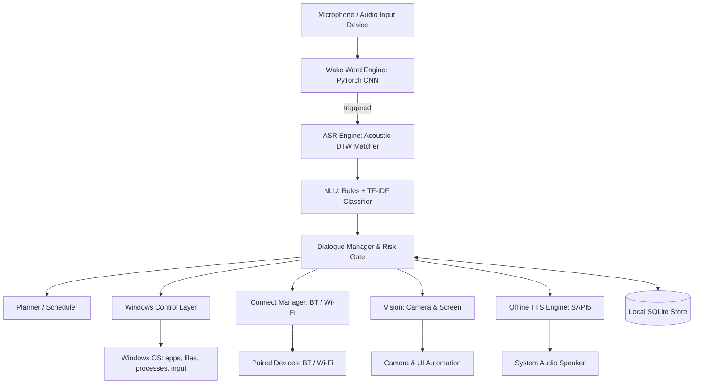

# Miku — Offline-First Personal AI Voice Assistant

Miku is a local-first, privacy-focused personal AI voice assistant for Windows built strictly adhering to two core engineering rules:
1. **Zero External API Keys**: Operates 100% offline without relying on cloud services (OpenAI, Google, Amazon, etc.).
2. **Zero Pretrained Black-Box Models**: Every learned component is trained from scratch locally on device or uses deterministic/rule-based systems.

---

## 🏛️ System Architecture



---

## 📦 Directory Structure

```
c:\miku/
├── wakeword/         # Custom PyTorch CNN keyword spotter ("Hey Miku") trained from scratch
├── asr/              # Offline acoustic DTW template matcher for voice commands
├── tts/              # Offline speech synthesis engine (Windows SAPI5 / pyttsx3)
├── llm/              # Custom Causal Transformer LLM (855K params) trained from scratch
├── nlu/              # Hybrid pattern matching + trainable TF-IDF Naive Bayes classifier
├── planner/          # Day scheduling, task planner, and SQLite database persistence
├── connect/          # Bluetooth & Wi-Fi device discovery with strict pairing consent
├── vision/           # Camera capture (OpenCV) & Screen inspection (Windows UI Automation)
├── control/          # PowerShell execution, app launcher, mouse/keyboard input simulation
├── orchestrator/     # Central dialogue manager, risk classifier, and intent router
├── tests/            # Automated test suite
├── miku_cli.py       # Interactive assistant CLI & voice loop
├── run_tests.py      # Test runner
└── README.md
```

---

## 🚀 Quick Start

### 1. Run Automated Verification Suite
```bash
python miku_cli.py --test-mode --no-tts
```

### 2. Interactive Text Console Mode
```bash
python miku_cli.py
```
Try commands like:
- `what is the time`
- `plan my day`
- `create task buy groceries with priority high`
- `open notepad and write an essay about quantum computing`
- `system status`
- `delete file old_data.log` *(Triggers the safety confirmation gate)*

### 3. Voice Listening Mode (Continuous Wake-Word Detection)
```bash
python miku_cli.py --voice
```
Say: *"Hey Miku"* to activate listening.

### 4. Run Unit Tests
```bash
python run_tests.py
```

---

## 🛡️ Security & Confirmation Gates
Per the PRD requirements:
- **Blocked Actions**: Permanent prohibition on CAPTCHA solving, silent pairing, and unauthorized credential bypass.
- **Confirmation Gating**: Actions involving file deletion, process termination, system alterations, and new device pairing require explicit verbal or typed confirmation (`yes` / `no`).
