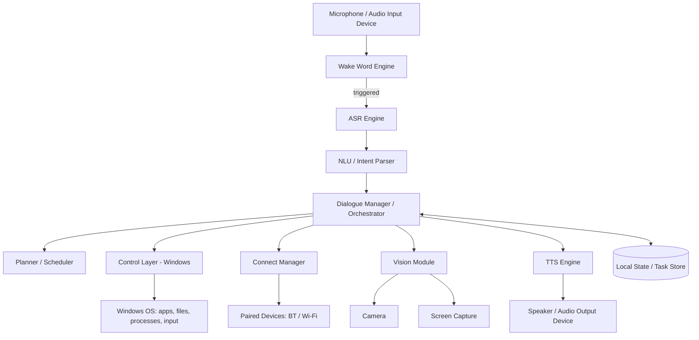

# System Architecture
## Miku — Offline-First Personal AI Voice Assistant (Windows Phase 1)

---

## 1. High-Level Architecture



All components run as local processes/services communicating over a lightweight local API (in-process function calls initially; local sockets/IPC if split into services later). Nothing here talks to an external cloud AI API.

---

## 2. Component Breakdown

### 2.1 Wake Word Engine
- Always-on, low-CPU keyword spotter.
- Custom-trained small CNN/RNN on MFCC or filterbank features.
- Training data: user-recorded wake-word samples + negative/background samples.
- Output: binary trigger → hands off audio stream to ASR.

### 2.2 ASR Engine (Hear)
- Converts captured audio into text after wake-word trigger.
- Base: small open architecture, fine-tuned on the user's voice and command vocabulary (not used as an unmodified frozen model).
- Runs on-device; no audio leaves the machine unless the user opts into an online mode for harder queries.

### 2.3 NLU / Intent Parser (Understand)
- Maps transcribed text → `{intent, entities}`.
- Hybrid approach:
  - Rule/pattern layer for common, well-defined commands (fast, deterministic, zero training data needed to bootstrap).
  - Small trained classifier for fuzzier/open-ended phrasing, retrained as the command set grows.
- Must support compositional commands (e.g., "open Notepad and write an essay about X") — decomposed into an action sequence, not a single fixed template.

### 2.4 Dialogue Manager / Orchestrator
- Central router: receives intent, decides which subsystem(s) handle it (Control, Planner, Connect, Vision), sequences multi-step actions, and requests confirmation when required (Section 7).
- Owns short-term conversational state (what was just asked, what's pending confirmation).

### 2.5 TTS Engine (Speak)
- Converts orchestrator responses to speech.
- Voice model trained/fine-tuned on a dataset the user provides.
- Runs locally; outputs to default or connected speaker.

### 2.6 Vision Module (See)
- Camera pipeline: lightweight local object/state recognition (small CNN, trained/fine-tuned on relevant scenarios rather than a large frozen vision model).
- Screen pipeline: screenshot + UI element detection (via Windows UI Automation tree first — far cheaper and more reliable than pixel-based recognition; pixel-based CV as fallback).

### 2.7 Planner / Scheduler (Plan)
- Rules/logic engine, not ML-dependent.
- Reads/writes local task and calendar data.
- Produces day plans or task sequences from stated goals; hands resulting action items to the Dialogue Manager for execution or reporting.

### 2.8 Connect Manager
- Handles Bluetooth/Wi-Fi discovery and pairing.
- **Hard rule:** never auto-pairs to a new device silently — always surfaces a confirmation prompt.
- Stores known-device credentials locally; if a stored credential fails (e.g., password changed), it stops and asks the user rather than retrying blindly.

### 2.9 Control Layer (Windows)
- Executes concrete actions on the host OS:
  - **PowerShell / CLI execution** for scripted system tasks.
  - **Win32 API / `pywin32`** for window and process management.
  - **UI Automation / `pywinauto`** for locating and interacting with UI elements reliably (preferred over raw pixel-coordinate clicking).
  - **Input simulation** (`pyautogui` or equivalent) for keyboard typing and mouse (LMB/RMB/MMB) actions where UI Automation isn't sufficient.
- Every call into this layer is tagged with a risk level; anything above "safe" (defined allowlist) routes back through the Dialogue Manager's confirmation step before executing.

---

## 3. Data Flow (Typical Command)

1. Mic stream → Wake Word Engine detects trigger.
2. Audio buffer → ASR → text.
3. Text → NLU → intent + entities.
4. Dialogue Manager evaluates: known/safe intent → route directly; risky intent → generate confirmation prompt → TTS asks user → wait for confirmation via ASR.
5. On confirmation (or if no confirmation needed): route to Control / Planner / Connect / Vision as appropriate.
6. Result/status → Dialogue Manager → TTS → spoken response.

---

## 4. Tech Stack (Phase 1 — Windows)

| Layer | Choice |
|---|---|
| Language (core) | Python (fastest iteration for ML + system scripting) |
| Wake word | Custom CNN, trained locally (PyTorch or lightweight ONNX runtime for inference) |
| ASR | Small open architecture, personally fine-tuned |
| TTS | Small open architecture, personally fine-tuned voice |
| NLU | Rule engine + lightweight classifier (scikit-learn or small PyTorch model) |
| System control | PowerShell, `pywin32`, `pywinauto`, input-simulation library |
| Vision | OpenCV + small trained/fine-tuned classifier; Windows UI Automation for screen |
| Local storage | SQLite or flat files for task/calendar/device data |
| Inference runtime | ONNX Runtime (CPU-optimized) to keep footprint light |

---

## 5. Model Training Strategy

- Every learned component starts from a small architecture trained or fine-tuned on data the user collects/owns, not deployed as a frozen third-party checkpoint.
- Iterative loop: collect data → train → evaluate on real usage → retrain as vocabulary/command set grows.
- Keep all models small enough for CPU inference so the assistant stays lightweight and doesn't require a dedicated GPU at runtime (GPU is for training only, and only if available).

---

## 6. Directory Structure (proposed)

```
miku/
├── wakeword/          # training scripts, model, inference
├── asr/                # ASR model + fine-tuning scripts
├── tts/                # TTS model + voice data
├── nlu/                # intent rules + classifier
├── planner/            # scheduling/task logic
├── connect/             # BT/Wi-Fi device management
├── vision/              # camera + screen modules
├── control/              # Windows control layer (PowerShell, Win32, UI Automation)
├── orchestrator/        # dialogue manager, confirmation logic, routing
├── data/                 # local task/calendar/device store
└── tests/                 # per-version test run suite
```

---

## 7. Security & Confirmation Gates

- Central **risk classifier** in the orchestrator: every action request is tagged safe / requires-confirmation / blocked (CAPTCHA-solving, silent pairing — permanently blocked per PRD).
- Confirmation is spoken or typed, logged, and required fresh each time (no "remember this choice forever" for destructive actions).
- New device pairing and changed credentials always interrupt the flow and ask the user directly.

---

## 8. Platform Portability (Future)

- Everything above the Control Layer (Hear, Speak, Understand, Plan, See, orchestration) is platform-agnostic by design and should be portable as-is.
- **Linux:** swap Control Layer implementation to shell scripting + X11/Wayland automation (e.g., `xdotool`).
- **Android:** cannot reuse the Python control layer — requires a separate native app using `AccessibilityService` (Kotlin/Java), communicating with the shared brain over local IPC/socket if run alongside a PC, or reimplementing lightweight versions of Hear/Speak/Understand on-device.

---

## 9. Phase 1 Milestones (maps to PRD roadmap)

1. Wake-word detector working standalone
2. ASR producing usable transcripts of test commands
3. NLU correctly parsing 10–15 target intents
4. Control layer executing those intents on Windows, with confirmation gating live
5. TTS responding to confirm actions
6. End-to-end voice-in → action → voice-out loop stable for a full test session
